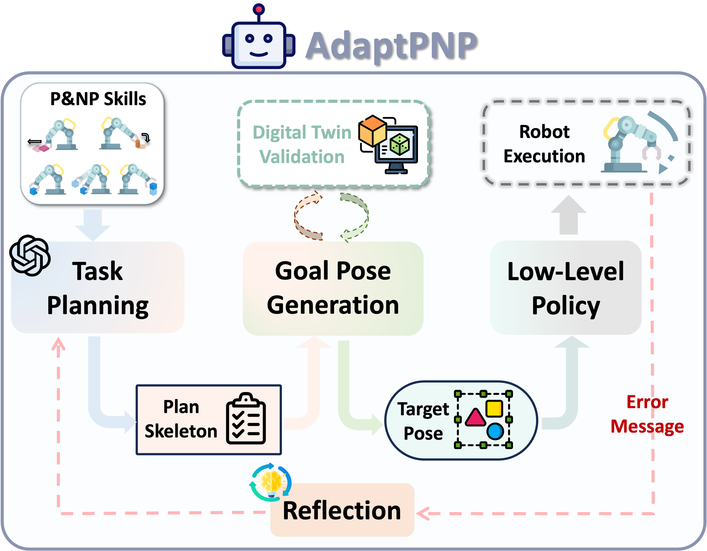

# AdaptPNP: Integrating Prehensile and Non-Prehensile Skills for Adaptive Robotic Manipulation




## Dependencies
#### IsaacSim Download

AdaptPNP is built upon **IsaacSim 4.5.0**, please refer to [NVIDIA Official Document](https://docs.isaacsim.omniverse.nvidia.com/latest/installation/download.html) for download. 

```We recommend placing the Isaac Sim source folder at `~/isaacsim_4.5.0` to match the Python interpreter path specified in the `.vscode/settings.json` file we provide. If you prefer to use a custom location, please make sure that the Python interpreter path in `.vscode/settings.json` is updated accordingly.```

We will use **~/isaacsim_4.5.0/python.sh** to run the isaacsim's python file. To facilitate the running, we can define a new alias in '.bashrc' file.

```bash
echo 'alias isaac="~/isaacsim_4.5.0/python.sh"' >> ~/.bashrc
source ~/.bashrc
```


Download the dependencies for isaac sim

```
issac -m pip install -r requirement.txt
```

Start the Demo_Scene to load the scene and test the IsaacSim download

```bash
isaac Env_StandAlone/Demo_Scene.py
```

#### Grasp Api

Because the GraspNet API environment is not directly compatible with Isaac Sim, we need to install the GraspNet API in a separate environment and establish a web-server interface for communication between Isaac Sim and the GraspNet API.

Here are the steps to follow:

1. Create conda environment for graspnet API:

```bash
conda create -n graspnet python=3.8 -y
conda activate graspnet
conda install pytorch==1.9.0 torchvision==0.10.0 torchaudio==0.9.0 cudatoolkit=11.1 -c pytorch -c nvidia
```

2. Validation of the environment:

```bash
conda activate graspnet # activate the environment

python # enter the python interpreter

>>> import torch
>>> torch.__version__
'1.9.0'
>>> torch.version.cuda
'11.1'
>>> torch.cuda.is_available()
True

# If all the above are True,
# Then the environment is set up correctly.
# If not,
# Please do the following steps:
conda deactivate

unset LD_LIBRARY_PATH

conda activate graspnet
```

3. Install the rest of the dependencies:

```bash
cd graspnet_flask
pip install -r requirements.txt

cd graspnet_flask/pointnet2
python setup.py install

cd graspnet_flask/knn
python setup.py install

cd graspnet_flask/graspnetAPI
pip install .
```

4. Run the server:

```bash
cd ../..
python graspnet_flask/grasp_backend.py
```


## How To Start

Now you already setup for the sim and the grasping backend, we can start to integrate it with non-prehensile skills in the simulator!

   

1. ##### Set your Openai API key and Doubao API key in [scripts/main.py](./scripts/main.py)

   You can get the Openai API key on [OpenAI](https://openai.com/index/openai-api/)

   You can get the Doubao API key on [Volcano Engine](https://www.volcengine.com/product/doubao)

   

3. ##### Set the task in [scripts/main.py](./scripts/main.py)

   First, you can choose from four predefined scenes: **align**, **bookshelf**, **wall**, or **slope**. To set the scene, simply import the desired environment class and instantiate it.

   ##### Example (using wall environment):

   ```
   # Set the scene here
   from Env_StandAlone.External_dexterity.wall import Demo_Scene_Env
   ```

   Second, the `task_instruction` defines the high-level goal the robot should accomplish. In the `main()` function, set the `task_instruction` to specify the goal you want the robot to perform.

   ##### Example:

   ```
   task_instruction = "Get the keyboard to the transparent target."
   ```

   

4. ##### Start simulation

   ```
   isaac scripts/main.py 
   ```

## Planning demo

You can refer to an introductory [Colab](https://colab.research.google.com/drive/1qinP-0Tsug-yYW8RfYqCKUJpxDSEMBFT?usp=sharing) notebook that demonstrates the examples of planning.

Remember to set the Openai API key.

## Citations

@article{zhu2025adaptpnp,
  title = {AdaptPNP: Integrating Prehensile and Non-Prehensile Skills for Adaptive Robotic Manipulation},
  author = {Zhu, Jinxuan and Tie, Chenrui and Cao, Xinyi and Wang, Yuran and Guo, Jingxiang and Chen, Zixuan and Chen, Haonan and Chen, Junting and Xiao, Yangyu and Wu, Ruihai and Shao, Lin},
  journal = {arXiv preprint arXiv:2511.11052},
  year = {2025}
}